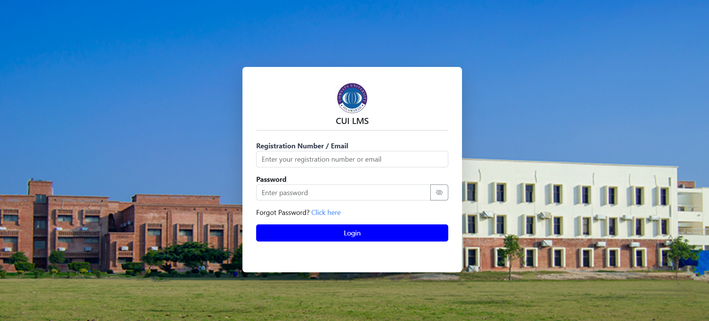

# Final-Year-Project

# University LMS Login Page (Frontend)

This is a simple **Login Page** for the University Learning Management System (LMS), designed for students. The page is built using **Bootstrap 5 (BS5)** and **Tailwind CSS** frameworks to provide a responsive, modern design.

**Note**: This module is currently a **static frontend** without any backend functionality. It only includes the layout, styling, and basic user interface (UI) elements.



## Features
- **Responsive Design**: Fully responsive layout for both desktop and mobile devices.
- **Password Visibility Toggle**: A button to show/hide the password for easy input.
- **Interactive Login Button**: The login button changes color when hovered over.
- **Forgot Password Link**: A link to help students recover their password.

## Technologies Used
- **HTML5**: Structure of the login page.
- **Bootstrap 5 (BS5)**: For layout and form styling.
- **Tailwind CSS**: Utility-first CSS for fast styling and modern design.
- **JavaScript**: To toggle password visibility on the input field.

## Installation

1. **Clone the repository**:
   ```bash
   git clone https://github.com/your-username/Final-Year-Project.git

2. **Open the project folder**:
   ```bash
   cd Final-Year-Project
   

   
